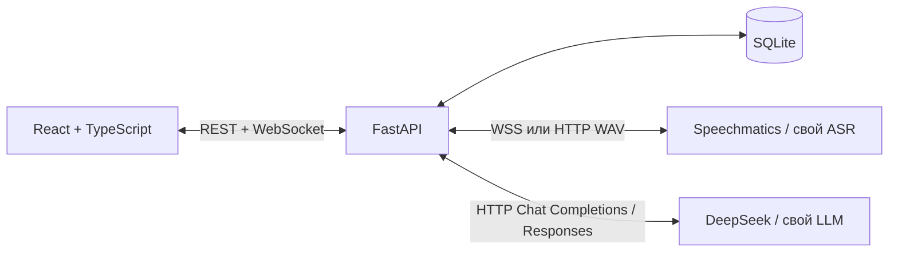

# Архитектура прототипа

Обновлено 2026-09-30 по уточнению пользователя: веб — макет внешней системы;
главный контракт — JSON Schema для LLM. Нет маскирования, обязательности заполнения,
утверждения документа и реального API МИС.

## Компоненты

Основные контейнеры: backend и web. Профили local-asr и local-llm добавляют
faster-whisper и Ollama. Nginx проксирует REST/WS на backend. SQLite в томе
хранит снимки сессий и аудиопакеты. Один worker FastAPI управляет асинхронными
сессиями. Ключи поставщиков только в окружении backend.

ASR_PROVIDER и LLM_PROVIDER независимы. Основной запуск: живой микрофон, локальный
Whisper и настоящий DeepSeek. Готовый пример разговора и endpoint /demo удалены.
ASR demo оставлен только как явный режим ввода собственного текста без микрофона;
демо-LLM — вспомогательный адаптер для тестов. Реальные провайдеры получают
аудио/текст без маскирования.

## Контракт формы

`contracts/default-form.schema.json` — JSON Schema Draft 2020-12 в ограниченном
подмножестве: корень object, плоские свойства string|null, optional enum, title,
description, additionalProperties=false, все ключи перечислены в required.
Проверка контракта запрещает произвольные схемы, удалённые ссылки и вложенность.
Отсутствие сведений — null; это не отрицание симптома.

`x-ui: textarea` и `x-enumLabels` служат только макету. Текст без подсказки — input,
с подсказкой — textarea, enum — radio. Нет обязательного выбора. Провайдеру LLM
передаётся схема без расширений UI. Ответ LLM — плоские значения. Файл не загружается
как вложение: схема передаётся в структурированном API-запросе.

Копия схемы фиксируется на сессию. Экспорт возвращает только values, без metadata UI.

## API

Префикс `/api/v1`:

| Метод/путь | Назначение |
|---|---|
| GET `/health` | Проверка доступности |
| GET `/config` | Режим и провайдеры без секретов |
| GET `/forms/default` | Стандартная JSON Schema |
| POST `/sessions` | `{formSchema}` → новый снимок |
| GET `/sessions/{id}` | Сохранённый снимок |
| PATCH `/sessions/{id}/fields/{fieldId}` | `{value, expectedRevision}` → ручная правка |
| POST `/sessions/{id}/fields/{fieldId}/unlock` | `{expectedRevision}` → автозаполнение |
| POST `/sessions/{id}/transcript` | `{text, speaker?}` → добавить текст и обработать LLM при ASR demo |
| POST `/sessions/{id}/stop` | Завершить обработку |
| POST `/sessions/{id}/clinical-assessment` | Запустить анализ текущих данных и дождаться результата |
| GET `/sessions/{id}/clinical-assessment/export` | Гипотезы, источник, время, статус проверки и устаревание |
| GET `/sessions/{id}/export` | Плоские значения |
| WS `/sessions/{id}/stream` | Аудио и события |

Клинический анализ использует отдельные инструкции и фиксированную JSON Schema,
но общий транспорт выбранного LLM. `clinicalAssessment` в снимке содержит values,
provider, model, generatedAt, transcriptRevision и documentRevision. Поля формы
и их ручные блокировки не меняются. `clinicalStatus`, `clinicalError` и
`clinicalRevision` позволяют показывать фоновую обработку и игнорировать старые
снимки. После успешного stop анализ запускается в отдельной задаче, только при
реальном LLM. Задача защищена от вытеснения сессии из кеша и отменяется при остановке
сервера; прерванный анализ после перезапуска отмечается ошибкой. Перед сохранением
результата проверяются обе версии входных данных. Экспорт клинического проекта
всегда указывает необходимость проверки врачом.

Snapshot: `id, formSchema, values, fieldMeta, transcript, status, documentRevision,
transcriptRevision, error`. Metadata поля: revision, source, locked, suggestion.
Реплика: id, revision, text, startMs, endMs, speaker.
Статус: ready/recording/processing/stopped/error.

REST использует версии для конфликтов (409). Схема/значения валидируются сервером
(422). UI сохраняет несохранённый текст при входящих снимках.

## WebSocket и аудио

JSON-событие: `{type, payload}`. При подключении — `session.snapshot`.
`stream.start`: audio `{encoding:"pcm_s16le",sampleRate:16000,channels:1}`.
Ответ `stream.ready`: streamId, throughSeq, nextSampleOffset.
`stream.resume` с тем же streamId восстанавливает соединение.

Binary packet: uint32LE seq с 1, uint32LE sampleOffset с 0, затем PCM16LE mono.
Порция около 200 мс. AudioWorklet преобразует частоту AudioContext к 16 кГц
с сохранением состояния между блоками.

- `audio.ack`: throughSeq после сохранения пакета; не означает распознавание.
- `transcript.partial`: временный текст для интерфейса.
- `session.snapshot`: полное текущее состояние после изменений.
- `error`: видимая ошибка операции.

Браузер ограничивает неподтверждённый буфер и повторяет пакеты после reconnect.
Сервер проверяет последовательность/повторы; два отправителя аудио не допускаются.
Перед stop фронтенд отправляет остаток PCM и получает ack всех пакетов: HTTP-команда
сама по себе не упорядочена относительно WS-аудио.

Restart backend сохраняет форму, но помечает активную обработку прерванной;
автоматическое восстановление ASR из дискового аудио не реализовано.

## Извлечение и объединение

Завершённые реплики запускают обработку. На сессию выполняется один LLM-запрос
одновременно, новые реплики объединяются в следующий. Промежуточные гипотезы ASR
не заполняют форму. Контекст — завершённая расшифровка с явным ограничением объёма;
превышение выдаёт ошибку вместо тихой обрезки.

Сервер проверяет полный объект LLM. DeepSeek получает JSON Schema в инструкциях
и response_format=json_object; thinking отключён для меньшей задержки. JSON mode
ограничивает синтаксис, но не соответствие полей схеме. Собственный сервер может
получать json_schema, если поддерживает strict Structured Outputs. Проверка
схемы не проверяет медицинскую достоверность. Ошибки/отказ/оборванный JSON не меняют форму.
Ручные значения, включая null, защищаются locked; предложение модели — отдельно.
Полный snapshot проще восстановить после разрыва, чем цепочку JSON Patch.

Остановка Speechmatics отправляет EndOfStream, ждёт EndOfTranscript и обработку
последней реплики. HTTP-ASR сбрасывает остаток WAV и ждёт обработки очереди.
Нажатие stop само по себе не означает завершённое заполнение.

## Подключаемые серверы

`ASR_PROVIDER=openai-compatible`: последовательные multipart-запросы
`POST {ASR_BASE_URL}/audio/transcriptions`, поля file (WAV), model,
response_format=json и необязательный language. ru/kk отправляются явно,
auto не передаёт language. Ожидается объект `{"text":"..."}`. Необязательный ключ
ASR_API_KEY передаётся Bearer. Адаптер ограничивает очередь, обрабатывает
последний короткий фрагмент и публикует final-сегменты с уникальными ID.
Промежуточных гипотез и диаризации у этого адаптера нет.

Разбиение после ASR_CHUNK_SECONDS (по умолчанию 5) и паузы 400 мс, либо принудительно
через 15 секунд. Границы фрагментов могут снижать качество распознавания.
Этот протокол удобен для замены сервера, но не даёт задержку настоящего streaming ASR.

Встроенный transcriber принимает только WAV PCM16 mono16k, до30 секунд; отдаёт text.
Он лениво загружает faster-whisper, выполняет один inference одновременно и
возвращает 429 при перегрузке. GET /health не скачивает модель; POST /v1/models/load
явно прогревает её. Веса в отдельном Docker volume. Для производительности можно
заменить сервис любым сервером с тем же контрактом.

`LLM_PROVIDER=openai-compatible`: `POST {LLM_BASE_URL}/chat/completions`,
messages, model, max_tokens, response_format. Настройки URL/ключей принимает только
окружение backend, не браузер. Ключи DeepSeek/OpenAI не наследуются собственными
провайдерами. JSON-схема и снимки сессий сохраняют прежний формат при замене серверов.

## Границы и будущая интеграция

- SQLite, один worker, локальный однопользовательский режим без авторизации.
- Нет маскирования, approval flow, API МИС и автоматического удаления аудио.
- ASR: Speechmatics WSS и совместимый HTTP-сервер (включён faster-whisper).
  Yandex SpeechKit API v3 рекомендуем оценить для русского/казахского;
  его gRPC-адаптер не реализован.
- Для API внешней системы нужны JSON Schema + session ID + values; веб можно
  заменить без изменения формата извлечения.

## Внешние протоколы

- [Speechmatics Realtime](https://docs.speechmatics.com/api-ref/realtime-transcription-websocket).
- [DeepSeek JSON mode](https://api-docs.deepseek.com/guides/json_mode/).
- [faster-whisper](https://github.com/SYSTRAN/faster-whisper).
- [Ollama API compatibility](https://docs.ollama.com/api/openai-compatibility).
- [Yandex: языки распознавания](https://yandex.cloud/ru-kz/docs/speechkit/stt/models).
- [OpenAI Structured Outputs](https://developers.openai.com/api/docs/guides/structured-outputs).
- [FastAPI WebSocket](https://fastapi.tiangolo.com/advanced/websockets/).
- [AudioWorklet](https://developer.mozilla.org/en-US/docs/Web/API/AudioWorklet).
